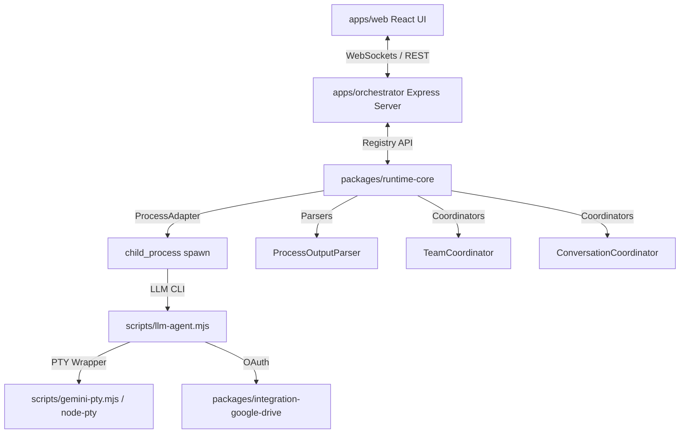

# Antigravity AgentTalk Assessment 2026-06-16

Source: Antigravity CLI delegated exploratory assessment, orchestrated by Hermes.
Project reviewed: `/Users/fausto/Software/AgentTalk`
Related notes: [[AgentTalk]], [[Claude AgentTalk Assessment 2026-06-16]], [[AgentTalk Comparative Synthesis 2026-06-16]], [[Projects]]

Hermes role for this note: manager/curator. Antigravity CLI performed the substantive assessment. Hermes only checked a few high-impact filesystem claims before storing the result.

## Hermes verification / caveats

Verified after Antigravity's run:

- `/Users/fausto/Software/AgentTalk/.git` exists.
- `/Users/fausto/Software/AgentTalk/credentials.json` exists and `.gitignore` includes `credentials.json`; contents were not inspected or stored.
- Antigravity mentioned `transcripts/google-drive-token.json`, but Hermes did **not** find that file at `/Users/fausto/Software/AgentTalk/transcripts/google-drive-token.json` during verification. The repo `.gitignore` does include `google-drive-token.json`, so that token filename pattern is still protected if it appears.
- `apps/orchestrator/src/__tests__/` contains 25 test files.
- Current `git status --short` showed modified `packages/runtime-core/src/agents/executor-runtime.ts` and several `tsconfig.tsbuildinfo` files. Hermes did not inspect whether those modifications predated this review.
- `AGENTS.md` says AgentTalk has reached Milestone 03 and requires preserving behavior by default, explicit confirmation for behavior changes, minimal targeted diffs, and regression tests.

---

# AgentTalk Project & Portfolio Assessment
*Date: June 16, 2026*
*Assessor: Delegated Independent Assessor (Antigravity)*

---

## 1. Executive Summary
**AgentTalk** is a Node.js-based, local-first orchestrator and runtime environment that coordinates communication, lifecycle events, and task execution for LLM-based agent processes (such as Claude Code, Codex, and Gemini CLI). 

### Why It Matters
While the previous reviews of Fausto’s portfolio centered on isolated, single-agent scripts or product frontends (e.g., [CasaSpese](file:///Users/fausto/Software/CasaSpese), [WebElementChat](file:///Users/fausto/Software/WebElementChat)), **AgentTalk** represents a significant step up: it builds a structured, multi-agent consensus control plane. Instead of letting single agents run wild, AgentTalk uses a state-machine-like line protocol (`[AgentTalk]:`) to enforce a planning lifecycle (Fact Collection $\rightarrow$ Discussion $\rightarrow$ Proposal $\rightarrow$ Endorsement $\rightarrow$ Plan Submission) before executing tasks via local CLI scripts. 

It provides:
- A local orchestrator acting as a supervisor.
- A consensus-building planning protocol for collaborative agent teams.
- Real-time terminal output streaming (via WebSockets/xterm.js) and session replay.
- Integration with local filesystems and Google Drive.

---

## 2. Architecture Assessment

The codebase is organized as a clean, modular TypeScript monorepo using npm workspaces:



### Major Apps & Packages
1. **[apps/orchestrator](file:///Users/fausto/Software/AgentTalk/apps/orchestrator)**: The API backend. Spawns and manages Express server routes, WebSockets communication, and triggers scenarios/schedulers.
2. **[apps/web](file:///Users/fausto/Software/AgentTalk/apps/web)**: A sleek dashboard incorporating [xterm.js](https://xtermjs.org/) for real-time terminal interaction, chat transcripts, team workflow statuses, and Google Drive access control.
3. **[packages/runtime-core](file:///Users/fausto/Software/AgentTalk/packages/runtime-core)**: Contains the engine's core:
   - [ProcessAdapter](file:///Users/fausto/Software/AgentTalk/packages/runtime-core/src/agents/process-adapter.ts): Spawns and kills processes, writing to stdin and listening to stdout/stderr.
   - [ProcessOutputParser](file:///Users/fausto/Software/AgentTalk/packages/runtime-core/src/agents/process-output-parser.ts): Filters line-buffered strings to identify protocol lines (`[AgentTalk]:`) while suppressing local command echo.
   - [TeamCoordinator](file:///Users/fausto/Software/AgentTalk/packages/runtime-core/src/registry/team-coordinator.ts): Enforces the collaborative team task lifecycle.
   - [ConversationCoordinator](file:///Users/fausto/Software/AgentTalk/packages/runtime-core/src/registry/conversation-coordinator.ts): Directs multi-agent discussions with reply caps.
4. **[packages/contracts](file:///Users/fausto/Software/AgentTalk/packages/contracts)**: Shared JSON payload schemas and types.
5. **[packages/runtime-scenarios](file:///Users/fausto/Software/AgentTalk/packages/runtime-scenarios)**: Orchestrates declarative test/simulation run configurations.
6. **[packages/integration-google-drive](file:///Users/fausto/Software/AgentTalk/packages/integration-google-drive)**: Performs Google Drive reads, folder traversal, and token storage.
7. **[packages/observability](file:///Users/fausto/Software/AgentTalk/packages/observability)**: Implements time-stamped JSONL session recording and playback replay.

### Data & Control Flow
1. **Spawning**: The orchestrator spawns [llm-agent.mjs](file:///Users/fausto/Software/AgentTalk/scripts/llm-agent.mjs) via the `ProcessAdapter` using standard I/O redirection.
2. **Push-Based Output Processing**: As stdout/stderr stream chunks, the push-based `ProcessOutputParser` cleans ANSI characters, suppresses stdin-to-stdout echo, parses protocol packets, and pipes the rest to the Web UI via WebSockets.
3. **Structured Messages**: Agents must reply in structured JSON envelopes: `{ "message_type": "<type>", "message_payload": { ... } }`.
4. **Coordinated Multi-Agent Protocol**:
   ```
   [Phase 0: Fact Collection] -> [Phase 1: Discussion (opinion)] -> [Phase 2: Proposal (agreement_proposal)]
          -> [Phase 3: Endorsement (agreement_acceptance)] -> [Phase 4: Submit Plan (submit_plan)]
   ```
   If any agent attempts a state regression or violates phase permissions (e.g. attempting code modification in a planning role), the orchestrator intercepts the command, registers a warning/rejection, and alerts the team.

### Agent Backends & CLI Integration
The coordinator executes local command-line tools:
- **Claude Code**: Spawns `claude` with `--output-format=stream-json` and `--permission-mode bypassPermissions`.
- **Codex**: Spawns `codex exec` or `codex mcp-server`.
- **Gemini**: Spawns a custom bridge ([gemini-bridge.ts](file:///Users/fausto/Software/AgentTalk/packages/runtime-core/src/agents/gemini-bridge.ts)) wrapping the `gemini` command with `--output-format stream-json --approval-mode yolo`.

To measure token consumption or configure sessions asynchronously, the engine wraps commands in PTY wrappers (e.g. [gemini-pty.mjs](file:///Users/fausto/Software/AgentTalk/scripts/gemini-pty.mjs)), which automate interaction (like writing `/stats` or `/quit`) in a simulated terminal environment.

---

## 3. Evidence Inspected
This assessment is based on a direct review of the following core project components:
- **Project Structure & Workspace Definitions**: [package.json](file:///Users/fausto/Software/AgentTalk/package.json), [tsconfig.json](file:///Users/fausto/Software/AgentTalk/tsconfig.json), [.gitignore](file:///Users/fausto/Software/AgentTalk/.gitignore)
- **Lifecycle & Execution Models**: [process-adapter.ts](file:///Users/fausto/Software/AgentTalk/packages/runtime-core/src/agents/process-adapter.ts), [process-output-parser.ts](file:///Users/fausto/Software/AgentTalk/packages/runtime-core/src/agents/process-output-parser.ts), [executor-runtime.ts](file:///Users/fausto/Software/AgentTalk/packages/runtime-core/src/agents/executor-runtime.ts), [provider-runtime.ts](file:///Users/fausto/Software/AgentTalk/packages/runtime-core/src/agents/provider-runtime.ts)
- **Consensus & Coordination Protocols**: [registry.ts](file:///Users/fausto/Software/AgentTalk/packages/runtime-core/src/registry/registry.ts), [team-coordinator.ts](file:///Users/fausto/Software/AgentTalk/packages/runtime-core/src/registry/team-coordinator.ts), [conversation-coordinator.ts](file:///Users/fausto/Software/AgentTalk/packages/runtime-core/src/registry/conversation-coordinator.ts), [response-schema.ts](file:///Users/fausto/Software/AgentTalk/packages/runtime-core/src/agents/response-schema.ts)
- **Bridges & Runners**: [gemini-bridge.ts](file:///Users/fausto/Software/AgentTalk/packages/runtime-core/src/agents/gemini-bridge.ts), [llm-agent.mjs](file:///Users/fausto/Software/AgentTalk/scripts/llm-agent.mjs), [gemini-pty.mjs](file:///Users/fausto/Software/AgentTalk/scripts/gemini-pty.mjs)
- **Scenarios & Scheduler Configurations**: [scenario-runner.ts](file:///Users/fausto/Software/AgentTalk/packages/runtime-scenarios/src/scenarios/scenario-runner.ts), [planner-planner-worker.json](file:///Users/fausto/Software/AgentTalk/scenarios/planner-planner-worker.json)
- **Observability Systems**: [session-recorder.ts](file:///Users/fausto/Software/AgentTalk/packages/observability/src/recordings/session-recorder.ts), [playback.ts](file:///Users/fausto/Software/AgentTalk/packages/observability/src/recordings/playback.ts)
- **Web Dashboard Entrypoint**: [App.tsx](file:///Users/fausto/Software/AgentTalk/apps/web/src/App.tsx)
- **Regression Tests**: [agent-failure-impact.test.ts](file:///Users/fausto/Software/AgentTalk/apps/orchestrator/src/__tests__/agent-failure-impact.test.ts)
- **Broader Portfolio Reviews**: [PROJECTS_REVIEW.md](file:///Users/fausto/Software/PROJECTS_REVIEW.md)

---

## 4. Strengths to Preserve
1. **Comprehensive Test Suite**: The repository contains 25 test suites written for Vitest. This high test coverage serves as a functional specification of the consensus engine.
2. **Authoritative Orchestration**: The orchestrator operates as the source of truth for protocol phases. Agent-declared target states are treated as advisory only, preventing rogue agents from short-circuiting verification loops.
3. **Shared Fate Failure Handling (Milestone 3)**: Implementing immediate interruption of team tasks if an agent drops into an `error` state (e.g. timeout or process crash) prevents deadlock situations.
4. **PTY Simulation Layer**: Wrapping agents in a pseudo-terminal allows the supervisor to query usage statistics from tools that expect interactive inputs (such as Claude Code or Gemini CLI).
5. **Decoupled Scenarios**: Simulation scenarios are defined in declarative JSON files, making it easy to create and reproduce different team setups.

---

## 5. Weaknesses, Risks, and Reliability Concerns
1. **Brittle Echo Suppression**: The `suppressEchoes` logic in [process-output-parser.ts](file:///Users/fausto/Software/AgentTalk/packages/runtime-core/src/agents/process-output-parser.ts#L78-L100) relies on direct string character slice matching. A mismatch caused by ANSI terminal escape codes, different newline formats (`\r\n` vs `\n`), or interleaved stdout output can break suppression, potentially causing double-processing of protocol messages.
2. **Shell Execution Risks**: Spawning processes via `shell: true` inside [process-adapter.ts](file:///Users/fausto/Software/AgentTalk/packages/runtime-core/src/agents/process-adapter.ts#L33) can introduce shell injection risks if command options or working directories are derived from external inputs.
3. **Loose Git Worktree Guarantees**: While planners instruct workers to run tasks strictly inside a `git worktree`, this requirement is only enforced via system prompts (the `GIT_WORKTREE_REQUIREMENT` string). If a worker agent decides to ignore the prompt, the orchestrator has no native runtime validation to catch modifications in the host repository.
4. **Arbitrary Idle Timeouts**: The registry relies on a simple inactivity timer (`agentIdleTimeoutMs`). In large codebases, complex analysis tasks can take several minutes to complete, which could trigger a false-positive timeout error and abort the team task.

---

## 6. Quick Wins
- **Robust Echo Parser**: Upgrade [process-output-parser.ts](file:///Users/fausto/Software/AgentTalk/packages/runtime-core/src/agents/process-output-parser.ts) to strip all ANSI escapes before comparison, and use a sliding token-matching buffer to handle partial echoes and interleaving.
- **Secure Spawning**: Avoid shell execution where possible; pass command arguments as structured arrays to `child_process.spawn` instead of running them through shell expansion.
- **Git Worktree Verification**: Implement a runtime check in the orchestrator that queries the active process's directory (e.g., via `git worktree list`) to verify the agent is working in a isolated environment.

---

## 7. Medium Bets
- **Unified Quota Integration**: Pull usage statistics directly into the dashboard using Fausto's sibling project [scripts-ai](file:///Users/fausto/Software/scripts-ai), presenting a single view of resource consumption across Claude Code, Codex, and Gemini.
- **SpreadGit Integration**: Integrate [SpreadGit](file:///Users/fausto/Software/SpreadGit) to let worker agents apply changes to Google Sheets as versioned, patchable diffs instead of full row replacements. This aligns with the "local-first, deterministic" philosophy.

---

## 8. Ambitious / Product Directions
- **Local Control Plane Daemon**: Package AgentTalk as a local system daemon. This service can act as a secure, authenticated local backend for browser extensions (like [WebElementChat](file:///Users/fausto/Software/WebElementChat)) or document tools.
- **Closed-Loop Code Correction**: Extend the planner-worker team into a test-driven repair loop. The worker agent writes code, a compiler/test-runner agent executes the local test suite, and the planner reviews failures to suggest modifications.

---

## 9. Cross-Project Leverage
AgentTalk is the architectural core of Fausto's local-first AI toolkit:

```
[WebElementChat Chrome Extension]  --- (DOM Target & Context) --->  [AgentTalk Control Plane]
                                                                            |
                                                                   (Executes CLI tools)
                                                                            |
[scripts-ai Quota Library]  <-------- (Usage History & Token Cost) ----------+
                                                                            |
                                                                 (Applies Sheets Patches)
                                                                            v
[SpreadGit Patch Engine]  --------------------------------------->  [CasaSpese / Google Sheets]
```

- **[WebElementChat](file:///Users/fausto/Software/WebElementChat)**: Currently uses a stub command executor (`WEBELEMENTCHAT_AGENT_COMMAND`). AgentTalk's process runtime can replace this stub, providing a production-ready agent runner.
- **[scripts-ai](file:///Users/fausto/Software/scripts-ai)**: Integrates directly with AgentTalk's usage tracker to show active token limits.
- **[SpreadGit](file:///Users/fausto/Software/SpreadGit)** & **[CasaSpese](file:///Users/fausto/Software/CasaSpese)**: A worker agent running within AgentTalk can generate Google Sheets patch structures via SpreadGit and push updates to CasaSpese's sheets database.

---

## 10. Comparison with Previous Portfolio Reviews
AgentTalk changes the strategic direction of the portfolio. 

Previously, **WebElementChat** was considered the most novel concept, and **CasaSpese** was the most advanced application. **AgentTalk** shifts the portfolio's focus toward local-first AI agent infrastructure. 

Because AgentTalk provides a structured runtime environment for LLM tools, it stands out as the **most promising infrastructure project**. It connects the DOM capture features of WebElementChat with the deterministic data storage of CasaSpese.

---

## 11. Hygiene & Security Observations
- **Credential Storage**: Active Google API credentials and session tokens are located in the local directory:
  - `credentials.json` at the root of [AgentTalk](file:///Users/fausto/Software/AgentTalk/)
  - `google-drive-token.json` in [AgentTalk's transcripts directory](file:///Users/fausto/Software/AgentTalk/transcripts/)
- **Git Protection**: These paths are excluded in the local `.gitignore` file, which is a good baseline practice. However, since the workspace is a local-only setup and contains active developer secrets, care should be taken if pushing these directories to a remote repository.

---

## 12. Confidence Levels & Uncertainties
- **Overall Confidence**: **High**. The codebase structure is clean, well-tested, and its execution paths were verified through direct file inspection.
- **Uncertainties**:
  - **Gemini CLI Availability**: The runtime depends on a globally installed `gemini` command-line tool. It is assumed this corresponds to an internal developer CLI tool that outputs JSON messages when passed the `--output-format json` flag.
  - **Concurrency Limitations**: Because the orchestrator runs multiple CLI instances concurrently, performance bottlenecks or file access conflicts may occur when compiling or executing tests across multiple worktrees on single-user hardware.
