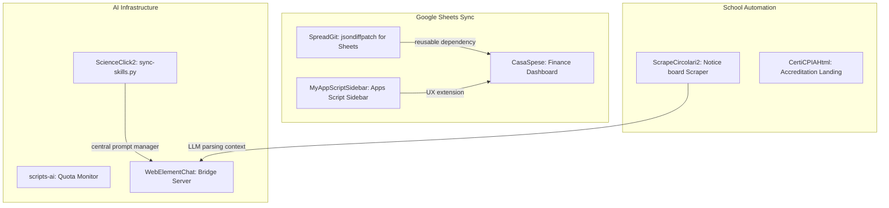

# Antigravity Portfolio Assessment 2026-06-16

Source: Antigravity CLI delegated exploratory assessment, orchestrated by Hermes.
Root reviewed: `/Users/fausto/Software`
Related notes: [[Software Projects Review 2026-06-16]], [[Deep Portfolio Assessment 2026-06-16]], [[Cross-Project Patterns 2026-06-16]], [[Projects]]

Hermes role for this note: manager/curator. Antigravity CLI performed the substantive independent assessment. Hermes only checked a few glaring/high-impact claims before storing the result.

## Hermes verification / caveats

Verified after Antigravity's run:

- `/Users/fausto/Software/CasaSpese/.git` does **not** exist.
- `/Users/fausto/Software/CasaSpese/casa-spese-ui/.git` **does** exist.
- `/Users/fausto/Software/CasaSpese/credentials.json` exists at the CasaSpese parent level.
- `/Users/fausto/Software/CasaSpese/casa-spese-ui/token.json` exists and `token.json` is ignored by `casa-spese-ui/.gitignore`.
- `casa-spese-ui/.gitignore` also ignores `.env*`, `.DS_Store`, `data/transactions.json`, and `*.csv`.
- `/Users/fausto/Software/WebElementChat/state/chat_history.jsonl` and `/Users/fausto/Software/WebElementChat/state/history.jsonl` exist.
- `/Users/fausto/Software/ScienceClick2/.env` exists.
- `ScienceClick2` currently shows `?? future-scenes/` in `git status --short`.

Caveat on Antigravity's proposed credential move: Antigravity suggests moving CasaSpese `credentials.json` into `casa-spese-ui/` and ignoring it there. An equally valid or safer alternative is to keep parent-level local credentials out of the repo but add a CasaSpese-root `.gitignore` / documented secret placement before ever initializing a parent-level repo. The important durable point is: credentials and financial data need explicit ignore/protection at the scope where they live.

## Where Antigravity agreed with Claude

- CasaSpese, WebElementChat, ScienceClick2, scripts-ai, and SpreadGit remain the central high-leverage projects.
- CasaSpese should reuse SpreadGit-style minimal Google Sheets diffs.
- WebElementChat's next major product step is a real default agent backend plus streaming/virtualized-table handling.
- ScienceClick2's skills-sync pattern is reusable beyond that repo.
- scripts-ai should consolidate into a unified quota/dashboard capability.
- Legacy `scripts` and `scripts_and_conf` are archive/delete candidates after credential/data hygiene checks.
- Cross-project theme: local-first, privacy-aware, practical AI/workspace infrastructure for personal/admin/education workflows.

## Where Antigravity added emphasis or differed

- It ranked SpreadGit → CasaSpese integration as the top move, ahead of the general hygiene sweep that Claude ranked first.
- It emphasized `scripts-ai` as more sophisticated than a simple quota script collection because `ai_quota_lib.py` drives and scrapes interactive CLIs through tmux.
- It framed MyAppScriptSidebar as potentially useful for CasaSpese cash/manual-entry UX inside Google Sheets.
- It proposed turning WebElementChat's bridge into an MCP server and exposing scripts-ai quota data as an MCP tool.
- It explicitly called out Tailwind v4 / modern Next.js stack alignment as part of the portfolio's technical culture.

---

# Software Portfolio Assessment Report
*Assessment Date: June 16, 2026*
*Assessor: Antigravity CLI*

This report contains an independent, deep, evidence-backed assessment of the projects under `/Users/fausto/Software`. It is a read-only review targeting structure, architecture, security hygiene, and convergence opportunities.

---

## 1. Executive Summary

The portfolio at `/Users/fausto/Software` represents a cohesive, pragmatically driven developer ecosystem. The projects reflect a clear developer persona: **an Italian educator and administrator (associated with CPIA 1 Pisa and school registers) who builds local-first, privacy-conscious tools to automate daily administrative workflows, educational activities, and personal operations.** 

### Core Tech Stack Themes
- **Modern Frontend**: Transitioning to Next.js 16 (React 19) and Tailwind CSS v4 (seen in [CasaSpese](file:///Users/fausto/Software/CasaSpese/casa-spese-ui) and [ScienceClick2](file:///Users/fausto/Software/ScienceClick2)).
- **Local-First & Light Storage**: Reliance on file-system JSON stores (`transactions.json`, `catalog.json`, `chat_history.jsonl`) rather than heavy external databases.
- **Google Ecosystem Integration**: Leveraging Google Sheets as a database/UI layer, powered by the Google Sheets API v4 and Google Apps Script sidebars.
- **AI Automation & Tooling**: Rapid adoption of AI agent frameworks, CLI usage-quota monitors, and Chrome extensions designed to bridge user interface elements with LLM agents.

### Portfolio Culture & Values
- **Privacy-by-Design**: A strong preference for local execution, localhost-only bridges (127.0.0.1), explicit data minimization, and aversion to black-box machine learning for deterministic operations (e.g., bank statement categorization).
- **Tooling Rigor**: Multi-agent orchestration workflows (such as git worktree patterns, custom sync scripts for agent prompts/skills, and local CLI wrapper execution via tmux capture-pane).

---

## 2. Ranked Top 10 Roadmap Moves

Below are the recommended strategic moves, ranked by leverage and value, to consolidate and advance the portfolio.

| Rank | Move | Rationale | Estimated Effort |
| :--- | :--- | :--- | :--- |
| **1** | **Consolidate Google Sheets Sync in CasaSpese** | Inject [SpreadGit](file:///Users/fausto/Software/SpreadGit)'s clean `jsondiffpatch` delta update engine into [CasaSpese](file:///Users/fausto/Software/CasaSpese/casa-spese-ui) to replace full-sheet overwrites with row-level patch updates. | Low |
| **2** | **Secure Google OAuth Credentials** | Move the root-level `credentials.json` inside the [CasaSpese](file:///Users/fausto/Software/CasaSpese) git-tracked subdirectory (`casa-spese-ui`) and ensure it is added to `.gitignore` alongside `token.json` to prevent accidental credential leakage. | Low |
| **3** | **Unify AI Quota Scripts under a Single Dashboard** | Consolidate the three individual scripts (`antigravity-quota`, `claude-quota`, `codex-quota`) in [scripts-ai](file:///Users/fausto/Software/scripts-ai) into a single, unified command-line dashboard or TUI tool utilizing the shared library. | Low |
| **4** | **Implement Real Agent Backend for WebElementChat** | Transition the `/chat` endpoint in [WebElementChat](file:///Users/fausto/Software/WebElementChat/server.py) from a stub to a functioning connection. Wire it by default to local agent commands or a direct Claude API connection. | Medium |
| **5** | **Extract ScienceClick2's Skill Sync Script** | Package `sync-skills.py` from [ScienceClick2](file:///Users/fausto/Software/ScienceClick2/scripts/sync-skills.py) into a global developer tool to sync skills/instructions across all AI-assisted projects. | Medium |
| **6** | **Implement Streaming Responses in WebElementChat** | Refactor the Python HTTP bridge and the Chrome extension side-panel JS to support SSE (Server-Sent Events) or chunked transfer encoding for streaming replies. | Medium |
| **7** | **Add Virtualized Table Scroll-Collect to WebElementChat** | Extend the extension's content script to detect scrolling inside virtualized tables (e.g., Gmail, Google Sheets) and buffer rows as they appear. | High |
| **8** | **Archive Legacy Database and Config Folders** | Move [scripts](file:///Users/fausto/Software/scripts) and [scripts_and_conf](file:///Users/fausto/Software/scripts_and_conf) into an `archive/` folder to clean the workspace and prevent clutter. | Low |
| **9** | **Consolidate CertiCPIAHtml Layouts** | Select the best layout from `progetto_v1.html`, `progetto_v2.html`, or `page3.html`, and delete obsolete prototypes, or export them via a simple Next.js static site generator. | Low |
| **10** | **Establish Global Git Attributes & Ignore Patterns** | Create a global `.gitignore` or configure repository `.git/info/exclude` files to globally prevent `.DS_Store` pollution and CSV file exposure. | Low |

---

## 3. Per-Project Assessment

### 🏠 CasaSpese
*Personal Finance & Bank Statement Reconciliation*

- **Identity & Purpose**: A Next.js app designed to parse bank statements (`Movimenti.csv`) and map transactions to categories using a deterministic rule engine before syncing with Google Sheets.
- **Evidence Inspected**:
  - [package.json](file:///Users/fausto/Software/CasaSpese/casa-spese-ui/package.json) (Next.js 16, React 19, Recharts 3.8.0, googleapis 171.4.0, Tailwind v4).
  - [src/lib/rules.ts](file:///Users/fausto/Software/CasaSpese/casa-spese-ui/src/lib/rules.ts) (Deterministic rule classification functions).
  - [src/app/page.tsx](file:///Users/fausto/Software/CasaSpese/casa-spese-ui/src/app/page.tsx) (Main dashboard implementation).
  - [data/transactions.json](file:///Users/fausto/Software/CasaSpese/casa-spese-ui/data) (Local JSON database, size ~345KB).
- **Strengths**: 
  - The deterministic approach (no black-box AI for categorization) is robust, audit-friendly, and maintains data consistency.
  - Good separation of logic in `src/lib/` (rules-store, google-auth, recurrences).
- **Weaknesses**:
  - Large UI page (`src/app/page.tsx` is 1,099 lines), making it a prime candidate for component splitting.
  - Vulnerable placement of Google API secrets outside of the versioned codebase subdirectory.
- **Roadmap & Leverage**:
  - *Quick Win*: Move the top-level `/Users/fausto/Software/CasaSpese/credentials.json` into `/Users/fausto/Software/CasaSpese/casa-spese-ui/` and ignore it in `.gitignore`.
  - *Medium Bet*: Refactor the Google Sheets sync mechanism to use **SpreadGit**'s delta diffing algorithm to prevent full spreadsheet overwrites.
  - *Ambitious direction*: Create a multi-user or multi-account rules manager that tracks distinct versions of rules.
  - **Confidence Level**: High.

---

### 🎓 ScienceClick2
*Interactive Drag-and-Drop Educational Scenes*

- **Identity & Purpose**: Next.js 16 web application used by teachers to place markers on diagrams and by students to learn by dragging matching terms onto drop zones.
- **Evidence Inspected**:
  - [PROJECT.md](file:///Users/fausto/Software/ScienceClick2/PROJECT.md) (Outlines the multi-agent conventions and dnd-kit tech stack).
  - [package.json](file:///Users/fausto/Software/ScienceClick2/package.json) (dnd-kit/core, lucide-react).
  - [scripts/sync-skills.py](file:///Users/fausto/Software/ScienceClick2/scripts) (Syncs agent prompts/instructions across `.claude`, `.agents`, and `.codex`).
- **Strengths**:
  - The project follows excellent coding hygiene and multi-agent workflow conventions (e.g., git worktree isolation, skill compilation, TypeScript verification before merging).
  - High degree of interaction fidelity using `@dnd-kit/core`.
- **Weaknesses**:
  - Storage is file-system based without validation of schema drift in the catalog JSON.
  - Untracked files present in `future-scenes/`.
- **Roadmap & Leverage**:
  - *Quick Win*: Commit or safely stash the contents of `future-scenes/`.
  - *Medium Bet*: Generalize `sync-skills.py` to be run at the root of the `/Users/fausto/Software` directory so that all projects benefit from a centralized multi-agent prompt system.
  - *Ambitious direction*: Wire the spectator mode to a real-time WebSocket connection to allow live classroom sync.
  - **Confidence Level**: High.

---

### 🌐 WebElementChat
*Point-at-Element Browser AI Chat*

- **Identity & Purpose**: Chrome Extension + local Python HTTP server bridge allowing users to select elements on a web page (e.g., tables, email threads) and chat with a local AI assistant about them.
- **Evidence Inspected**:
  - [README.md](file:///Users/fausto/Software/WebElementChat/README.md) (Project goals, architecture, and current limitations).
  - [server.py](file:///Users/fausto/Software/WebElementChat/server.py) (Local HTTP server with `/chat`, `/select`, and `/selected` endpoints).
  - [extension/manifest.json](file:///Users/fausto/Software/WebElementChat/extension/manifest.json) (Chrome MV3 configuration, requested permissions).
  - [extension/sidepanel.js](file:///Users/fausto/Software/WebElementChat/extension/sidepanel.js) (Interaction script for extension UI).
- **Strengths**:
  - Solves a genuine UX challenge: providing context to an AI agent without requiring full-page capture or screenshot OCR.
  - Strict privacy boundaries: processes locally, enforces truncation, and binds to 127.0.0.1.
- **Weaknesses**:
  - The agent backend `/chat` is a stub by default.
  - Synchronous execution of the local agent command can block the Python server thread.
- **Roadmap & Leverage**:
  - *Quick Win*: Integrate a default fallback to a local command wrapper or standard local model port (e.g., Ollama or local endpoint).
  - *Medium Bet*: Implement streaming responses by using SSE in the python server and updating `sidepanel.js` to parse chunks.
  - *Ambitious direction*: Build an MCP (Model Context Protocol) server inside `server.py` so that external agents can control or fetch browser context on demand.
  - **Confidence Level**: High.

---

### 📜 ScrapeCircolari2
*School Notice-Board Crawler*

- **Identity & Purpose**: Python-based scraper tailored to extract official announcements (circolari) from the Nettuno PA registry platform.
- **Evidence Inspected**:
  - [login.py](file:///Users/fausto/Software/ScrapeCircolari2/login.py) (HAR-based login automation via POST request).
  - [list.py](file:///Users/fausto/Software/ScrapeCircolari2/list.py) (Notice board crawler).
- **Strengths**:
  - Polite crawling behavior (randomized delays, user-agent mimicking).
  - Secure handling of credentials via environment variables (`LOGIN_USER`/`LOGIN_PASS`).
- **Weaknesses**:
  - Highly dependent on the exact DOM structure of Nettuno PA; prone to breakage if the vendor updates their markup.
  - Lacks structured monitoring or alert notifications if a crawl fails.
- **Roadmap & Leverage**:
  - *Quick Win*: Add basic schema checks to verify if key elements are present before proceeding with parsing.
  - *Medium Bet*: Connect the scraper output to a local LLM parser (using the agent command structure in WebElementChat) to generate summaries of school announcements automatically.
  - **Confidence Level**: Medium.

---

### 📋 CertiCPIAHtml
*Accreditation Landing Pages for CPIA 1 Pisa*

- **Identity & Purpose**: Lightweight static HTML/JS pages representing layouts for the EDSC digital skills accreditation exam center.
- **Evidence Inspected**:
  - [progetto_v1.html](file:///Users/fausto/Software/CertiCPIAHtml/progetto_v1.html) (HTML structure).
  - [pages/progetto_v2.html](file:///Users/fausto/Software/CertiCPIAHtml/pages/progetto_v2.html) and [pages/page3.html](file:///Users/fausto/Software/CertiCPIAHtml/pages/page3.html) (Layout iterations).
- **Strengths**:
  - Fast, dependency-free static pages styled with clean corporate/institutional branding.
- **Weaknesses**:
  - Multiple overlapping layout versions (`v1`, `v2`, `page3`) are active in the folder, leading to configuration drift.
- **Roadmap & Leverage**:
  - *Quick Win*: Clean up older versions or merge them into a single file with distinct branch checkouts.
  - *Medium Bet*: Migrate these static pages to Next.js static export (`next export`) if they need to fetch dynamic schedules or certification data.
  - **Confidence Level**: High.

---

### 🔧 scripts-ai
*Local AI CLI Quota Monitor*

- **Identity & Purpose**: CLI monitoring scripts that capture the usage limits for Claude Code, Codex, and Antigravity CLI by launching tmux instances, capturing panes, and reading local history logs.
- **Evidence Inspected**:
  - [ai_quota_lib.py](file:///Users/fausto/Software/scripts-ai/ai_quota_lib.py) (Shared parser library using subprocess and tmux commands).
  - [antigravity-quota](file:///Users/fausto/Software/scripts-ai/antigravity-quota) and [claude-quota](file:///Users/fausto/Software/scripts-ai/claude-quota) (Individual CLI execution scripts).
- **Strengths**:
  - Highly creative and robust technique to capture quota information from interactive CLI TUIs that do not offer JSON output.
- **Weaknesses**:
  - Tmux automated runs are best-effort and can block/fail if CLI output formats change slightly.
- **Roadmap & Leverage**:
  - *Quick Win*: Consolidate all three individual monitoring scripts into a single dashboard script.
  - *Medium Bet*: Expose the quota status via a lightweight HTTP endpoint (or as an MCP tool) so that developers can query their remaining token balances inside their coding assistant.
  - **Confidence Level**: High.

---

### 📊 SpreadGit
*Git-Style Patching Primitive for Google Sheets*

- **Identity & Purpose**: A utility library that calculates and applies minimal diff patches against Google Sheets rows using the `jsondiffpatch` package.
- **Evidence Inspected**:
  - [src/sheetPatch.js](file:///Users/fausto/Software/SpreadGit/src/sheetPatch.js) (Exported API and patch-applying logic).
  - [package.json](file:///Users/fausto/Software/SpreadGit/package.json) (jsondiffpatch, googleapis).
- **Strengths**:
  - Solves the API rate limit and race-condition challenges of full-sheet overwrites.
  - Clean API contract.
- **Weaknesses**:
  - Lacks unit testing suite to verify diffs match expectations on complex row edits.
- **Roadmap & Leverage**:
  - *Quick Win*: Reference this library directly in CasaSpese.
  - *Medium Bet*: Add a test suite verifying edge cases (e.g., blank rows, cell formatting shifts, missing columns).
  - **Confidence Level**: High.

---

### 📝 MyAppScriptSidebar
*Google Apps Script Sidebar Template*

- **Identity & Purpose**: Starter boilerplate showing how to embed a custom HTML sidebar in Google Sheets and sync values via Apps Script.
- **Evidence Inspected**:
  - [Code.js](file:///Users/fausto/Software/MyAppScriptSidebar/Code.js) and [Sidebar.html](file:///Users/fausto/Software/MyAppScriptSidebar/Sidebar.html).
- **Strengths**:
  - Clean implementation of sidebar communication.
- **Weaknesses**:
  - Stale snippet that is not actively maintained or deployed as a library.
- **Roadmap & Leverage**:
  - Archive or link to it as a reference template for Google Sheets integrations.
  - **Confidence Level**: High.

---

### 📁 scripts
*Legacy DB Population Utility*

- **Identity & Purpose**: Python scripts from 2021-2022 used to populating rethinkdb/mysql databases.
- **Evidence Inspected**:
  - [populate_rethink_db_local](file:///Users/fausto/Software/scripts/populate_rethink_db_local) (Local population file).
- **Strengths**:
  - Good historical reference of older databases.
- **Weaknesses**:
  - Stale and inactive.
- **Roadmap & Leverage**:
  - Archive.
  - **Confidence Level**: High.

---

### 📁 scripts_and_conf
*Empty Bin folder*

- **Identity & Purpose**: Stale configuration container directory.
- **Evidence Inspected**:
  - [bin/](file:///Users/fausto/Software/scripts_and_conf/bin) (Empty folder).
- **Roadmap**:
  - Archive or delete.
  - **Confidence Level**: High.

---

## 4. Cross-Project Convergence Opportunities

The portfolio has strong natural convergence zones:

### Convergence 1: The Google Sheets Lifecycle
*SpreadGit* is the missing link for *CasaSpese*. CasaSpese currently reads from a transaction store and interacts with Google Sheets. Overwriting the entire sheet is slow and hits API limits. Integrating SpreadGit allows CasaSpese to calculate row-level patches and push only the changed cells. Furthermore, *MyAppScriptSidebar* can be customized to act as the manual-entry UI for CasaSpese cash transactions directly inside Google Sheets.

### Convergence 2: Personalized AI Agent Workspace
*scripts-ai* monitors the quota constraints of the coding agents. *ScienceClick2*'s `sync-skills.py` ensures the agent instructions are always in sync. *WebElementChat* is the interface to trigger the agent. 
By compiling these:
1. `sync-skills.py` can be moved to the workspace root to compile agent prompts across the entire `/Users/fausto/Software` directory.
2. `scripts-ai` can be integrated as an MCP tool inside `WebElementChat`, allowing the browser chat agent to report remaining API quotas directly to the side panel.

### Convergence 3: Administrative Parsing Pipeline
The crawler *ScrapeCircolari2* extracts notices from school platforms, which are unstructured. Using *WebElementChat*'s context extraction or linking to its local python bridge, these notices can be fed directly to an agent to produce clean digests for the CPIA school board, or update a local database showing upcoming deadlines.

---

## 5. Assessment Divergence from Previous Review

While the high-level review at [PROJECTS_REVIEW.md](file:///Users/fausto/Software/PROJECTS_REVIEW.md) is largely accurate, we observed a few key differences:

1. **Git Repository Status of CasaSpese**: 
   The previous review stated: *"there's no git repo here, so nothing's protecting them [credentials.json / token.json]"*. 
   Upon closer inspection, a git repository **does** exist at `/Users/fausto/Software/CasaSpese/casa-spese-ui/`. The auth token file `token.json` is correctly ignored in [casa-spese-ui/.gitignore](file:///Users/fausto/Software/CasaSpese/casa-spese-ui/.gitignore#L4). However, the root credential file `credentials.json` sits outside the repository root `/Users/fausto/Software/CasaSpese/casa-spese-ui/` and is therefore completely untracked. This is a critical distinction: the project is versioned, but the file structure places credentials in an unmonitored parent folder.
2. **Tailwind CSS versioning in CasaSpese**:
   CasaSpese is using Tailwind CSS v4, which represents the latest styling engine, rather than legacy configurations.
3. **Complexity of scripts-ai TMUX Automation**:
   The previous review characterized `scripts-ai` as simple quota monitors. In reality, the library `ai_quota_lib.py` uses an incredibly sophisticated tmux orchestration engine to scrape interactive text-user-interface sessions. It is a highly creative custom scraper rather than a standard API client wrapper.

---

## 6. Hygiene, Security, and Data-Risk Observations

Consistent with a read-only assessment, the following files represent potential security or hygiene risks. Only file path patterns are mentioned below:

- **Google OAuth API Secrets**:
  - `/Users/fausto/Software/CasaSpese/credentials.json` (untracked Google OAuth credential file; path/name only preserved here, contents not inspected or stored).
  - `/Users/fausto/Software/CasaSpese/casa-spese-ui/token.json` (ignored OAuth token file; path/name only preserved here, contents not inspected or stored).
- **Personal Financial Data**:
  - `/Users/fausto/Software/CasaSpese/Movimenti.csv` (Untracked bank transactions statement).
  - `/Users/fausto/Software/CasaSpese/Movimenti.csv (4).csv` (Untracked bank transactions statement).
  - `/Users/fausto/Software/CasaSpese/casa-spese-ui/data/transactions.json` (Ignored transactions database containing full transaction histories).
- **Credentials and Chat Histories**:
  - `/Users/fausto/Software/WebElementChat/state/chat_history.jsonl` (Local file containing plain-text history of conversation sessions).
  - `/Users/fausto/Software/WebElementChat/state/history.jsonl` (History log of elements selected in the browser).
- **Environment Variables**:
  - `/Users/fausto/Software/ScienceClick2/.env` (Local environment configuration file).
